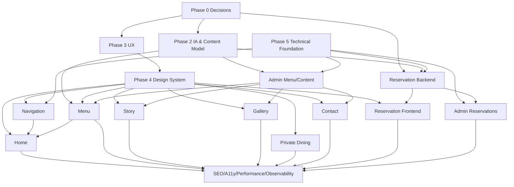

# EMBER & OAK — PHASE 1 DEPENDENCY MAP

## 1. Product dependency

## 2. Phase 0 blockers affecting backlog

| Decision | Affected tickets |
|---|---|
| DEC-0008 Currency | Menu pricing formatting, admin menu validation |
| DEC-0009 Timezone | Availability, confirmation, admin schedule |
| DEC-0011 Dining duration | Availability engine |
| DEC-0012 Guest range | Reservation search/validation |
| DEC-0013 Booking window | Reservation search/availability |
| DEC-0014 Same-day cutoff | Availability |
| DEC-0015 Cancellation cutoff | Manage/cancel workflow |
| DEC-0019 Availability model | Capacity/table schema + engine |
| DEC-0020 Dress code | Contact/policy content |
| DEC-0022 Production contact/address | Contact + SEO structured data |

## 3. Cross-cutting constraints

### Reservation
Không triển khai final domain model trước DEC-0009, DEC-0011, DEC-0012, DEC-0013, DEC-0014, DEC-0019.

### Menu
UI có thể build với fixture data; production persistence phụ thuộc Phase 2 content model.

### Home
Có thể build structure sau Phase 4; Signature Menu preview phụ thuộc Menu data contract.

### SEO
Metadata framework có thể làm sớm; structured data production phụ thuộc contact/location/content thật.

### Admin
Không được tự có business logic khác backend domain service.
