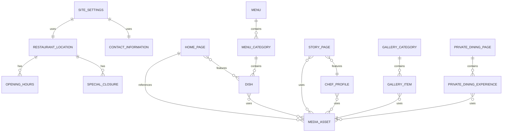

# EMBER & OAK — CONTENT MODEL

Status: **DRAFT SCHEMA CONTRACT**

This document defines conceptual entities. It is not yet an ORM schema.

---

# 1. Modeling rules

## 1.1. IDs

Every persistent content entity should have a stable unique identifier.

Implementation may use UUID/CUID/database-native IDs later.

## 1.2. Slugs

Public content that has its own route/anchor should use stable slugs where useful.

## 1.3. Publish state

Recommended shared lifecycle:

```text
DRAFT
PUBLISHED
ARCHIVED
```

Not every entity needs all states, but public editorial content should not publish immediately on save unless product intentionally chooses that model.

## 1.4. Ordering

Editorial lists should use explicit `displayOrder`, not depend on creation timestamps.

## 1.5. Media

Content should reference canonical `MediaAsset` instead of duplicating image metadata in every entity.

---

# 2. Core entity map



---

# 3. SiteSettings

Purpose: global brand/public settings used across routes.

```text
id
brandName
siteTitle
defaultSeoTitle
defaultSeoDescription
defaultSocialImageId?
primaryLanguage
supportedLanguages[]
locationId
contactInformationId
createdAt
updatedAt
```

### Notes

- `primaryLanguage` and `supportedLanguages` must not silently assume final multi-language strategy.
- If multi-language remains deferred, schema can still avoid blocking future localization.

---

# 4. RestaurantLocation

Purpose: canonical restaurant location.

```text
id
name
addressLine1
addressLine2?
wardOrDistrict?
city
region?
postalCode?
countryCode
timezone
latitude?
longitude?
directionsUrl?
isPrimary
createdAt
updatedAt
```

### Validation

- `timezone` must be valid IANA timezone.
- Address fields must support current Vietnam baseline.
- Coordinates optional until production location is verified.

### Status

- Single-location MVP proposed.
- Data model can remain location-capable without implementing multi-location UI.

---

# 5. ContactInformation

```text
id
email
phoneDisplay
phoneE164
instagramUrl?
facebookUrl?
createdAt
updatedAt
```

### Validation

- Email format.
- Phone canonical value stored separately from display formatting where possible.
- Social URL optional.

---

# 6. OpeningHours

```text
id
locationId
dayOfWeek
openTime?
closeTime?
isClosed
displayOrder
```

### Constraints

- Closed day should not require open/close values.
- Time interpreted in restaurant timezone.
- Multiple service windows per day are not currently required by source; if later needed, migrate to service-window model.

---

# 7. SpecialClosure

Operational content boundary:

```text
id
locationId
date
startTime?
endTime?
reason
publicMessage?
isFullDay
publishState
```

### Notes

This entity impacts reservation availability but is still editable operational content.

Reservation engine remains authority for booking availability later.

---

# 8. HomePage

Purpose: editable Home-page editorial content.

```text
id
heroEyebrow?
heroHeading
heroDescription
heroPrimaryMediaId
heroSecondaryMediaId?
philosophyLabel
philosophyHeading
philosophyBody
philosophyMediaId?
atmosphereHeading
atmosphereBody?
atmosphereMediaId
reservationHeading
reservationBody?
seoTitle?
seoDescription?
publishState
updatedAt
```

### Featured dishes relation

Do not duplicate dish fields.

```text
HomeFeaturedDish
- homePageId
- dishId
- displayOrder
```

---

# 9. Menu

```text
id
name
slug
description?
seasonLabel?
validFrom?
validTo?
isPrimary
publishState
seoTitle?
seoDescription?
createdAt
updatedAt
```

### Notes

MVP likely uses one active primary menu, but modeling a `Menu` entity avoids binding categories directly to the entire restaurant forever.

---

# 10. MenuCategory

```text
id
menuId
name
slug
description?
displayOrder
isActive
createdAt
updatedAt
```

### Constraints

- `slug` unique within menu.
- Explicit order required.

---

# 11. Dish

```text
id
categoryId
name
slug
description
priceAmount
currencyCode
primaryMediaId?
isAvailable
seasonalStatus
isFeatured
displayOrder
publishState
createdAt
updatedAt
```

### Seasonal status proposal

```text
CORE
SEASONAL
LIMITED
```

This enum is **PROPOSED**, not source-defined.

### Price rule

Do not store formatted strings such as:

```text
"350.000đ"
```

Canonical model should store numeric amount + currency code; formatting belongs presentation layer.

### Availability distinction

`isAvailable` = currently orderable/listable.

`publishState` = whether content is published.

A published but temporarily unavailable dish may still be visible if product chooses that UX.

---

# 12. ChefProfile

```text
id
name
title
shortBio
fullBio?
philosophy?
quote?
portraitMediaId
secondaryMediaIds[]
signatureMediaId?
publishState
updatedAt
```

### Notes

MVP assumes one Executive Chef profile, but entity should not hard-code person identity into page structure.

---

# 13. DiningExperience

For Home and potential reusable experience content.

```text
id
title
slug
description
priceLabel?
mediaId
ctaLabel?
ctaTarget?
displayOrder
publishState
```

Examples:

- Chef's Tasting Menu.
- Wine Pairing.
- Private Dining.

`priceLabel` remains display text because experience pricing may be descriptive rather than atomic commerce pricing.

---

# 14. StoryPage

```text
id
introHeading
introBody?
originHeading
originBody
foundersHeading?
foundersBody?
philosophyHeading
philosophyBody
sourcingHeading
sourcingBody
sustainabilityHeading
sustainabilityBody
designHeading
designBody
chefProfileId
seoTitle?
seoDescription?
publishState
updatedAt
```

### Media relations

Use ordered section media:

```text
StorySectionMedia
- storyPageId
- sectionKey
- mediaAssetId
- displayOrder
```

---

# 15. GalleryCategory

```text
id
name
slug
displayOrder
isActive
```

Seed taxonomy may include:

```text
food
chef
ingredients
kitchen
dining-room
wine
guests
```

Names are editable content; slug stability should be considered before changing public URLs/filters.

---

# 16. GalleryItem

```text
id
categoryId
mediaAssetId
altText
caption?
displayOrder
publishState
createdAt
updatedAt
```

### Constraint

Alt text required unless media explicitly marked decorative.

---

# 17. PrivateDiningPage

```text
id
heroHeading
heroDescription
heroMediaId
introBody?
enquiryHeading
enquiryBody?
seoTitle?
seoDescription?
publishState
updatedAt
```

---

# 18. PrivateDiningExperience

```text
id
pageId
name
slug
description
capacityMin?
capacityMax?
capacityLabel
mediaId
displayOrder
publishState
```

### Seed values from source

```text
Private Room       12–20
Chef's Table        6–8
Full Buyout         up to 80
```

`capacityLabel` exists because `"up to 80"` cannot always be communicated cleanly from min/max alone.

---

# 19. PolicyContent

Purpose: public operational policies.

```text
id
policyType
title
body
publishState
updatedAt
```

### Proposed policy types

```text
DRESS_CODE
RESERVATION
CANCELLATION
PRIVACY
TERMS
```

Business rules still `OPEN` must not be marked published.

---

# 20. MediaAsset

Canonical media entity.

```text
id
assetType
sourceUrl
storageKey?
mimeType
width
height
aspectRatio
fileSizeBytes?
altText?
caption?
focalPointX?
focalPointY?
credit?
copyrightOwner?
usageRights?
createdAt
updatedAt
```

### Asset types

```text
IMAGE
VIDEO
```

### Rules

- Production images require known dimensions.
- Below-fold images should support optimized delivery.
- Video must have poster/fallback image.
- Heavy mobile autoplay is prohibited by project requirements.

---

# 21. SEO metadata

Avoid copying SEO fields into every entity unless needed.

Recommended reusable concept:

```text
SeoMetadata
- title
- description
- canonicalPath?
- socialImageId?
- noIndex
```

Implementation can embed these fields in page entities instead of separate table; Phase 2 does not mandate storage architecture.

---

# 22. Transactional boundaries — NOT FINALIZED IN PHASE 2

The following concepts are referenced but not fully modeled here:

```text
Reservation
Customer
Table / Capacity
PrivateEventEnquiry
AdminUser
AuditLog
```

Reason:

- Reservation duration is still a business decision.
- Availability model is still open.
- Table-aware vs capacity-first affects schema.
- Auth architecture belongs later technical phase.

Phase 8 should own final transactional schema.

---

# 23. Localization readiness

Current project materials indicate Vietnamese-first direction with English considered, but multi-language rollout is not fully locked.

Recommended Phase 2 rule:

Do not duplicate localized fields like:

```text
titleVi
titleEn
descriptionVi
descriptionEn
```

across every entity yet.

Prefer a localization strategy to be selected in technical architecture when multi-language becomes confirmed.

---

# 24. Deletion strategy

Public content should prefer:

```text
ARCHIVED
```

over hard deletion when the content may be referenced elsewhere.

Examples:

- Dish.
- Chef.
- Gallery item.
- Menu category.

Hard deletion behavior should be explicit in admin later.

---

# 25. Naming conventions

Entity names:
- Singular PascalCase conceptually.

Fields:
- camelCase.

Slugs:
- lowercase kebab-case.

Examples:

```text
MenuCategory
displayOrder
private-dining
```
