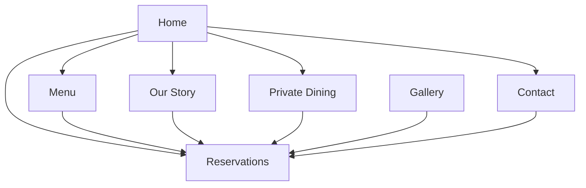

# EMBER & OAK — SITEMAP & INFORMATION ARCHITECTURE

Status: **DRAFT / STRUCTURE CONFIRMED**

## 1. Route map

```text
/
├── Home
├── Menu
├── Our Story
├── Private Dining
├── Gallery
├── Reservations
└── Contact
```

Route list là Release 1 scope đã freeze ở Phase 0.

---

# 2. Global information architecture

## 2.1. Global Header

### Primary navigation

```text
Home
Menu
Our Story
Private Dining
Contact
```

### Primary CTA

```text
Reserve a Table
```

### Mobile

- Navigation drawer/menu.
- Sticky `Reserve a Table` CTA.
- Menu interaction không phụ thuộc hover.

---

## 2.2. Global Footer

### Brand statement

```text
COME HUNGRY.
LEAVE INSPIRED.
```

### Navigation groups

- Our Story.
- Menu.
- Private Dining.
- Reservations.
- Contact.

### Social

- Instagram.
- Facebook.

### Operational information

- Address.
- Phone.
- Email.

### Legal

- Copyright.
- Privacy.
- Terms.

---

# 3. Home

## 3.1. Hero

### Content

- Eyebrow/optional label.
- Main heading.
- Description.
- `View Menu`.
- `Reserve a Table`.
- Primary hero image.
- Optional supporting image.
- Optional establishment/location metadata.
- Optional award/badge only when factual data exists.

### Data source

- `SiteSettings`
- `HomePage`
- `MediaAsset`

---

## 3.2. Philosophy

### Content

- Section label.
- Heading.
- Body.
- Supporting image/media.

### Topics supported

- Seasonal ingredients.
- Local sourcing.
- Sustainability.
- Open-fire cooking.
- Minimal intervention.

### Data source

- `HomePage.philosophy`
- `MediaAsset`

---

## 3.3. Signature Menu

### Content

- Section label.
- Heading.
- Featured dishes.
- Dish image mapping.
- `Explore Full Menu`.

### Data source

- `Dish`
- `MenuCategory`
- `MediaAsset`

### Rule

Featured dishes phải reference canonical `Dish`, không duplicate thành separate content records.

---

## 3.4. Restaurant Atmosphere

### Content

- Full-width media.
- Overlay heading.
- Optional supporting copy.

### Media topics

- Dining room.
- Evening lighting.
- Open kitchen.
- Chef plating.
- Wine service.

### Data source

- `HomePage.atmosphere`
- `MediaAsset`

---

## 3.5. Chef Story

### Content

- Chef name.
- Title.
- Short biography.
- Philosophy/background.
- Quote.
- Portrait/supporting images.
- Optional signature image.

### Data source

- `ChefProfile`
- `MediaAsset`

---

## 3.6. Dining Experiences

### Experiences

- Chef's Tasting Menu.
- Wine Pairing.
- Private Dining.

### Content per experience

- Title.
- Short description.
- Price/display text if applicable.
- Hero/supporting image.
- CTA.

### Data source

- `DiningExperience`

---

## 3.7. Reservation CTA

### Content

- Heading.
- Supporting copy.
- CTA.

### Data source

- `HomePage.reservationCta`
- Reservation route.

---

## 3.8. Location Summary

### Content

- Address.
- Opening hours.
- Phone.
- Email.
- Directions CTA.

### Data source

- `RestaurantLocation`
- `OpeningHours`
- `ContactInformation`

---

# 4. Menu

## 4.1. Page intro

- Label.
- Heading.
- Description.
- Optional season/current menu title.

## 4.2. Category navigation

Examples:

- Snacks.
- Starters.
- Mains.
- Sides.
- Desserts.
- Tasting Menu.
- Drinks/Wine only if business includes them in public menu.

Actual category names are content, not hard-coded IA.

## 4.3. Dish list

Per dish:

- Name.
- Description.
- Price.
- Optional image.
- Availability.
- Seasonal state.
- Dietary/allergen notes only if later approved.

## 4.4. Reservation CTA

Menu must provide fast path to reservation.

### Data source

- `Menu`
- `MenuCategory`
- `Dish`
- `MediaAsset`

---

# 5. Our Story

## Section hierarchy

```text
Intro
↓
Origin
↓
Founders
↓
Executive Chef
↓
Philosophy
↓
Ingredient Sourcing
↓
Sustainability
↓
Restaurant Design
↓
Reservation CTA
```

### Data source

- `StoryPage`
- `ChefProfile`
- `MediaAsset`

### Editorial rule

Không trình bày như corporate company profile.

---

# 6. Private Dining

## 6.1. Intro

- Heading.
- Description.
- Hero media.

## 6.2. Experiences

### Private Room

Capacity baseline:

```text
12–20 guests
```

### Chef's Table

```text
6–8 guests
```

### Full Restaurant Buyout

```text
Up to 80 guests
```

## 6.3. Enquiry

Fields:

- Name.
- Email.
- Phone.
- Event date.
- Guests.
- Event type.
- Budget.
- Message.

### Data source

Content:
- `PrivateDiningPage`
- `PrivateDiningExperience`

Submission:
- transactional `PrivateEventEnquiry` boundary; final domain schema belongs later phase.

---

# 7. Gallery

## 7.1. Gallery categories

Supported content taxonomy:

- Food.
- Chef.
- Ingredients.
- Kitchen.
- Dining Room.
- Wine.
- Guests.

## 7.2. Layout

Primary layout:

- Masonry.
- Asymmetric grid.

Simple carousel is not primary gallery architecture.

## 7.3. Item content

- Image.
- Alt text.
- Caption.
- Category.
- Display order.
- Publish state.

### Data source

- `GalleryCategory`
- `GalleryItem`
- `MediaAsset`

---

# 8. Reservations

## Information architecture

```text
Search
↓
Availability
↓
Slot Selection
↓
Guest Details
↓
Submit
↓
Confirmation
```

## Step 1 — Search

- Date.
- Guests.
- Optional time preference if business rules later require.

## Step 2 — Availability

States:

- Loading.
- Available.
- Fully booked.
- Closed.
- Invalid request.
- Unsupported guest count.
- Error.

## Step 3 — Guest Details

- Name.
- Email.
- Phone.
- Special request.

## Step 4 — Confirmation

- Reservation ID.
- Date.
- Time.
- Guest count.
- Contact.
- Notes.

CTA:

- Add to Calendar.
- Manage Reservation if later included.

### Boundary note

This route consumes reservation domain/API; Phase 2 does not define final transactional DB design.

---

# 9. Contact

## Sections

### Location

- Restaurant name.
- Address.
- Directions CTA.

### Opening Hours

- Day/day group.
- Open time.
- Close time.
- Closed state.

### Contact

- Email.
- Phone.

### Policy information

- Dress code.
- Reservation policy.
- Cancellation policy.

Policy content that is still `OPEN` must stay unpublished or explicitly marked draft.

### Data source

- `RestaurantLocation`
- `OpeningHours`
- `ContactInformation`
- `PolicyContent`

---

# 10. Cross-route relationships



Primary conversion path remains `Reserve a Table`.

---

# 11. URL proposal

Final route naming should be framework-neutral:

```text
/
 /menu
 /our-story
 /private-dining
 /gallery
 /reservations
 /contact
```

Localized path strategy is deferred until multi-language implementation is confirmed.

---

# 12. Indexability

## Indexable

- Home.
- Menu.
- Our Story.
- Private Dining.
- Gallery.
- Contact.

## Conditional

- Reservation search landing may be indexable.
- Reservation confirmation must not be indexable.
- Future manage-reservation pages must not expose guest data to indexing.

---

# 13. Navigation priority

Priority order:

```text
Reserve a Table
Menu
Our Story / Experience
Private Dining
Contact
Gallery
```

This is information priority, not necessarily literal nav ordering.
