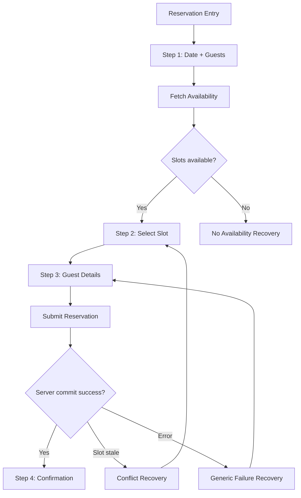

# EMBER & OAK — RESERVATION UX FLOW

Status: **CORE UX SPECIFICATION**

## 1. Goal

A guest should be able to create a reservation with minimal friction while preserving server authority over availability.

## 2. Flow overview



---

# 3. Reservation entry points

Supported:

- Header Reserve CTA.
- Hero Reserve CTA.
- Menu CTA.
- Home reservation section.
- Footer.
- Mobile sticky CTA.
- Direct `/reservations`.

Entry should not duplicate user data unless query parameters are intentionally supported later.

---

# 4. Step 1 — Search

## Fields

```text
DATE
GUESTS
```

Optional `TIME PREFERENCE` stays hidden until business rule/design explicitly confirms it.

## Desktop low-fi

```text
┌─────────────────────────────────────────────────────────────────────┐
│ RESERVE YOUR TABLE                                                  │
│                                                                     │
│ DATE                 GUESTS                         [ FIND A TABLE ] │
│ [ dd/mm/yyyy ]       [ 2 Guests ▼ ]                                │
└─────────────────────────────────────────────────────────────────────┘
```

## Mobile low-fi

```text
RESERVE YOUR TABLE

DATE
[ dd/mm/yyyy ]

GUESTS
[ 2 Guests ▼ ]

[ FIND A TABLE ]
```

## Validation

Client-side:
- Required.
- Clearly invalid date.
- Known guest-range constraint when confirmed.

Server-side remains authority.

## Business-rule dependencies

- Guest min/max.
- Booking window.
- Same-day cutoff.
- Restaurant timezone.

These may not be hard-coded while decision remains open.

---

# 5. Step 2 — Availability

## Success

```text
AVAILABLE TIMES

18:00
18:30
19:00
19:30
20:00
```

Low-fi:

```text
DATE SUMMARY     GUEST SUMMARY
Friday ...       2 Guests

AVAILABLE TIMES
[18:00] [18:30] [19:00] [19:30] [20:00]
```

### Interaction

- Single selection.
- Visible selected state.
- Keyboard operable.
- Touch target sufficient.
- Selection does not create reservation.

## No slots

```text
No tables are available for this date.

[ CHOOSE ANOTHER DATE ]
```

Optional:
- Surface next available dates only if API/domain later supports it.

## Restaurant closed

Clearly distinguish from fully booked:

```text
The restaurant is closed on this date.
[ CHOOSE ANOTHER DATE ]
```

## Unsupported guest count

```text
For larger parties, please contact Private Dining.
[ VIEW PRIVATE DINING ]
```

Actual threshold remains configuration.

---

# 6. Step 3 — Guest Details

Low-fi:

```text
YOUR TABLE
Date
Time
Guests
[ CHANGE ]

YOUR DETAILS

NAME
[                                      ]

EMAIL
[                                      ]

PHONE
[                                      ]

SPECIAL REQUEST
[                                      ]
[                                      ]

[ COMPLETE RESERVATION ]
```

## UX rules

- Preserve selected date/time at top.
- Allow explicit change without losing all details where possible.
- Do not request payment in MVP unless scope changes.
- Special request is optional unless later specified.
- Privacy/consent copy belongs here if required by final legal design.

---

# 7. Submit behavior

On submit:

```text
Button disabled
→ progress state
→ server validates input
→ server re-checks availability
→ transaction/locking
→ success or recoverable error
```

UI must not:
- Show confirmation before commit.
- Create a second request from double-click.
- Clear fields while request is pending.

---

# 8. Step 4 — Confirmation

Low-fi:

```text
✓ YOUR TABLE IS RESERVED

RESERVATION ID
EO-XXXXXXXX

DATE
...

TIME
...

GUESTS
...

CONTACT
...

SPECIAL REQUEST
...

[ ADD TO CALENDAR ]

Need help?
Restaurant email / phone
```

`Manage Reservation` only appears if included in release scope.

## Confirmation behavior

- Unique success page/state.
- Refresh should not accidentally resubmit booking.
- Page should not expose unnecessary PII.
- Confirmation route/state should not be indexable.

---

# 9. Change-search behavior

Guest can change:
- Date.
- Guests.
- Slot.

Recommended UX:

```text
Step 2/3
→ CHANGE
→ Step 1 or Step 2
→ preserve non-conflicting guest data
```

Changing date/guest count invalidates selected slot.

---

# 10. Back-navigation behavior

- Step 2 → Step 1: preserve search input.
- Step 3 → Step 2: preserve guest fields when possible.
- After confirmed reservation: browser Back must not resubmit.
- Confirmation page should be safe on refresh.

---

# 11. Concurrency conflict UX

If selected slot becomes invalid:

```text
That time is no longer available.

We kept your details.
Please choose another time.

[18:30] [19:30] [20:00]
```

Rules:
- Preserve guest information.
- Refresh server slots.
- Remove stale selected slot.
- Do not call it a generic server error.

---

# 12. Ambiguous network timeout

If client does not know whether request reached server:

Do not say:
- “Reservation failed” with certainty.
- “Reservation confirmed” without response.

UX should:
- explain that confirmation could not be verified,
- provide safe retry/check path once backend contract defines idempotency/lookup behavior.

Final copy depends on Phase 5/8 API design.

---

# 13. Analytics boundary

Possible future events:

```text
reservation_cta_clicked
availability_searched
slot_selected
guest_form_started
reservation_submitted
reservation_confirmed
reservation_failed
```

Never include:
- Name.
- Email.
- Phone.
- Special request text.
