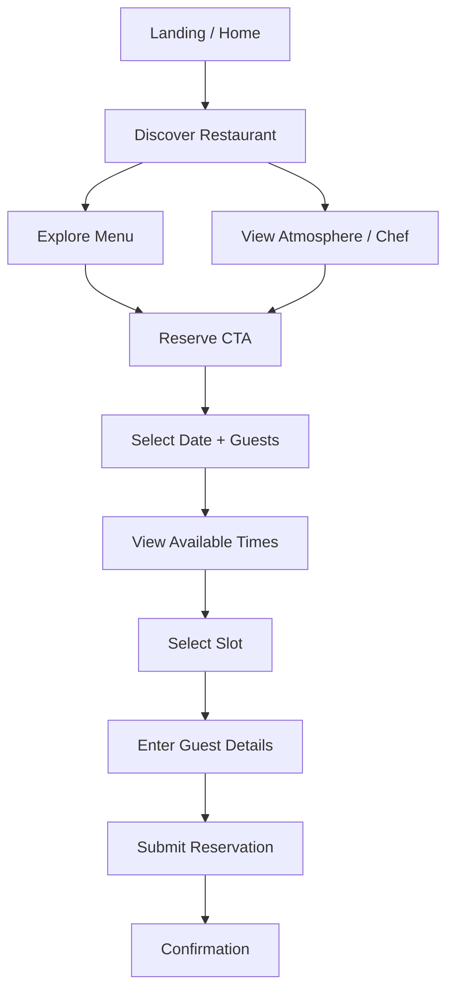

# EMBER & OAK — USER JOURNEYS

Status: **UX FLOW BASELINE**

## 1. Primary journey — Discovery to Reservation



### Success condition

Guest receives clear confirmation containing:
- Reservation ID/code.
- Date.
- Time.
- Guest count.
- Contact.
- Notes if applicable.

---

## 2. Search-driven journey — Menu first

```text
Search engine / direct link
→ Menu
→ browse dishes
→ Reserve a Table
→ availability
→ guest details
→ confirmation
```

### UX implication

Menu must:
- Be crawlable/indexable.
- Not hide all dish information behind interaction.
- Provide a strong reservation path.

---

## 3. Occasion-driven journey — Private Dining

```text
Home
→ Dining Experiences
→ Private Dining
→ choose experience context
→ Plan Your Event
→ enquiry form
→ success acknowledgement
```

### UX implication

Private Dining enquiry is not the same flow as regular table reservation.

Do not force:
- 12–20 guest Private Room request
through the normal regular reservation UI if regular guest range is smaller.

---

## 4. Story-driven journey

```text
Home
→ Philosophy
→ Chef Story
→ Our Story
→ Reservation CTA
```

Goal:
- Build trust.
- Build emotional motivation.
- Convert after storytelling.

---

## 5. Location-driven journey

```text
Search / Contact
→ Opening Hours
→ Address
→ Directions
→ Reserve
```

Operational facts must be easy to scan.

---

## 6. Gallery-driven journey

```text
Gallery
→ explore atmosphere/food
→ Reserve CTA
```

Gallery must not become an interaction trap with no conversion path.

---

## 7. Reservation recovery journey — No availability

```text
Search
→ No available slots
→ choose alternate date
OR
→ adjust guest count if valid
OR
→ contact/private dining if group unsupported
```

Do not present a dead-end message.

---

## 8. Reservation recovery journey — Slot conflict

Scenario:

```text
User selects 19:00
→ enters details
→ another guest books that capacity
→ user submits
→ server rejects stale slot
```

Required recovery:

```text
Conflict message
→ preserve guest information
→ refresh availability
→ highlight alternate times
→ user selects new slot
→ resubmit
```

Do not clear the entire form.

---

## 9. Reservation recovery journey — Network/server failure

```text
Submit
→ network/server failure
→ show failure clearly
→ preserve inputs
→ provide retry
```

The UI must not imply whether reservation exists unless server response confirms it.

For ambiguous network timeout, message should avoid creating false certainty and should provide a safe recovery path.

---

## 10. Unsupported party journey

If selected guest count exceeds regular reservation range:

```text
Guest count exceeds online regular booking rule
→ explain limitation
→ link to Private Dining / Contact
```

The actual guest threshold remains a business rule until confirmed.

---

## 11. Mobile journey

```text
Home
→ sticky Reserve CTA
→ vertical reservation search
→ time slots
→ guest form
→ confirmation
```

Key rule:
- User should never need hover.
- Sticky CTA should not cover form controls or final submit.

---

## 12. Navigation journeys

### Home → Menu
Primary food-discovery path.

### Home → Story
Brand discovery path.

### Home → Private Dining
Occasion/business path.

### Any major public page → Reservation
Conversion path.

### Any major public page → Contact
Operational-information path.

---

## 13. Journey priority

| Journey | Priority |
|---|---|
| Home → Reservation | P0 |
| Menu → Reservation | P0 |
| Direct Reservations | P0 |
| Contact/Hours | P0 |
| Home → Menu | P0 |
| Private Dining enquiry | P1 |
| Story → Reservation | P1 |
| Gallery → Reservation | P1 |
