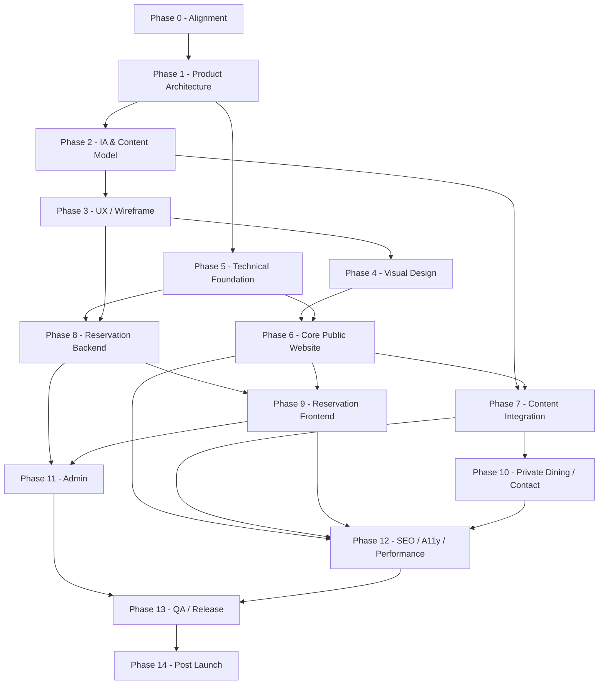

# EMBER & OAK — IMPLEMENTATION PHASES

> Implementation roadmap được xây dựng từ tài liệu `ember-and-oak-project-overview.md`.
>
> Mục tiêu của roadmap này là chuyển concept sản phẩm thành các phase có thể triển khai, kiểm thử và nghiệm thu độc lập.
>
> **Nguyên tắc:** tài liệu nguồn là baseline về product/design. Các mục liên quan cách tổ chức engineering, dependency, Definition of Done và release strategy trong file này là đề xuất triển khai.

---

# 1. Mục tiêu triển khai

EMBER & OAK là website cho nhà hàng fine dining hiện đại, tập trung vào ba trụ cột:

1. **Food** — món ăn, nguyên liệu, menu, kỹ thuật chế biến.
2. **Story** — chef, triết lý, nguồn gốc thương hiệu.
3. **Experience** — không gian, dịch vụ và trải nghiệm dining.

Website phải đồng thời đạt bốn mục tiêu:

- Xây dựng cảm nhận thương hiệu cao cấp ngay từ lần truy cập đầu tiên.
- Truyền tải câu chuyện ẩm thực theo hướng editorial, không giống website bán đồ ăn nhanh hoặc template SaaS.
- Giúp người dùng khám phá Menu / Chef / Atmosphere / Private Dining dễ dàng.
- Tối ưu conversion cho hành động **Reserve a Table**.

---

# 2. Phạm vi sản phẩm

## 2.1. Public website

Các route chính:

```text
/
├── Home
├── Menu
├── Our Story
├── Private Dining
├── Gallery
├── Reservations
└── Contact
```

Các thành phần quan trọng:

- Header + sticky navigation.
- Hero.
- Philosophy.
- Signature Menu.
- Atmosphere.
- Chef Story.
- Dining Experiences.
- Reservation.
- Gallery.
- Private Dining.
- Our Story.
- Contact & Location.
- Footer.
- Mobile sticky reservation CTA.

## 2.2. Reservation system

Core booking flow:

```text
Landing / Menu / CTA
        ↓
Reservation
        ↓
Select Date
        ↓
Select Guests
        ↓
Find Available Times
        ↓
Select Time
        ↓
Enter Guest Information
        ↓
Create Reservation
        ↓
Confirmation
```

Reservation states:

```text
PENDING
CONFIRMED
SEATED
COMPLETED
CANCELLED
NO_SHOW
```

## 2.3. Admin

Admin cần quản lý tối thiểu:

- Reservations.
- Menu.
- Customers.
- Private Events.
- Website Content.

## 2.4. Production capabilities không mặc định đưa vào MVP

Tài liệu nguồn nói website production **có thể** hỗ trợ:

- Newsletter.
- Multi-language.
- Event announcement.
- Special closure.
- Analytics.
- Một số chức năng content nâng cao.

Các chức năng này nên được quản lý như backlog sau MVP, trừ khi business xác nhận là launch requirement.

---

# 3. Chiến lược chia phase

Roadmap đề xuất gồm 14 phase:

```text
Phase 0   Project Alignment
Phase 1   Product Architecture & Backlog
Phase 2   Information Architecture & Content Model
Phase 3   UX / Wireframe / Reservation Flow
Phase 4   Visual Design System & High-Fidelity UI
Phase 5   Technical Foundation
Phase 6   Public Website — Core Experience
Phase 7   Menu / Story / Gallery / Content Integration
Phase 8   Reservation Backend & Availability Engine
Phase 9   Reservation Frontend & Confirmation
Phase 10  Private Dining / Contact / Operational Content
Phase 11  Admin Backoffice
Phase 12  SEO / Accessibility / Performance / Analytics
Phase 13  QA / UAT / Security / Release
Phase 14  Post-Launch Stabilization & Iteration
```

Không nên triển khai tuyến tính tuyệt đối. Một số track có thể chạy song song sau khi dependency đã ổn định.

---

# 4. Dependency Map



---

# 5. PHASE 0 — PROJECT ALIGNMENT

## Mục tiêu

Biến concept hiện tại thành baseline có thể triển khai, tránh thay đổi product direction trong lúc code.

## Input

- Project overview hiện tại.
- Brand concept.
- Route list.
- Design direction.
- Reservation flow.
- Admin requirements.

## Công việc

### 5.1. Xác định launch scope

Chia requirement thành:

```text
MUST
SHOULD
COULD
NOT NOW
```

### MUST — đề xuất cho MVP

- Home.
- Menu.
- Our Story.
- Private Dining.
- Gallery.
- Reservations.
- Contact.
- Responsive/mobile.
- Reservation creation.
- Reservation confirmation.
- Admin reservations.
- Admin menu.
- Admin content cơ bản.
- SEO cơ bản.
- Performance optimization.
- Production monitoring/error tracking.

### SHOULD

- Reservation management.
- Special closure.
- Event announcement.
- Customer reservation history.
- VIP tag.
- Private-event lead management.

### COULD

- Newsletter.
- Multi-language.
- Advanced analytics.
- Advanced CRM segmentation.

## Quyết định cần chốt

- Website có một location hay nhiều location.
- Currency.
- Time zone của restaurant.
- Reservation duration mặc định.
- Khoảng cách giữa các reservation slots.
- Guest limit.
- Booking window.
- Same-day reservation policy.
- Cancellation policy.
- Dress code.
- Deposit/payment có cần hay không.
- Email confirmation có cần ngay ở MVP hay không.
- Table assignment có tự động hay admin thủ công.

> Những rule trên không được mô tả đầy đủ trong source overview, nên cần được coi là business decisions thay vì tự suy diễn trong code.

## Deliverables

- `scope.md`
- `business-rules.md`
- `decision-log.md`
- MVP backlog.
- Danh sách non-MVP features.

## Exit Criteria

Phase hoàn thành khi:

- Không còn ambiguity lớn về MVP.
- Route list được freeze cho release đầu tiên.
- Reservation business rules đủ để thiết kế data model.
- Có owner cho content, design và engineering.

---

# 6. PHASE 1 — PRODUCT ARCHITECTURE & BACKLOG

## Mục tiêu

Chuyển scope thành các epic, feature và user story kỹ thuật.

## Epic đề xuất

```text
EPIC-01 Brand Experience
EPIC-02 Navigation
EPIC-03 Home
EPIC-04 Menu
EPIC-05 Story
EPIC-06 Gallery
EPIC-07 Private Dining
EPIC-08 Reservations
EPIC-09 Contact & Location
EPIC-10 Admin Reservations
EPIC-11 Admin Menu
EPIC-12 Admin Content
EPIC-13 SEO
EPIC-14 Performance
EPIC-15 Accessibility
EPIC-16 Observability & Operations
```

## Ví dụ user story

### Reservation

```text
As a guest
I want to select date, time and number of guests
So that I can reserve a table without contacting the restaurant manually.
```

### Menu

```text
As a visitor
I want to browse the current seasonal menu
So that I can understand the dining experience before booking.
```

### Admin

```text
As restaurant staff
I want to see reservations by date and status
So that I can manage service operations.
```

## Definition of Ready cho một ticket

Một task chỉ nên vào development khi có:

- Requirement.
- UX state.
- Acceptance criteria.
- API/data dependency.
- Responsive behavior.
- Error/loading/empty states nếu có.
- Asset/content dependency.
- Analytics event nếu cần.

## Deliverables

- Product backlog.
- Epic breakdown.
- Ticket template.
- Definition of Ready.
- Definition of Done.
- Dependency map.

## Exit Criteria

- Core features đã được phân thành ticket có thể estimate.
- Dependency frontend/backend rõ ràng.
- Không còn epic quá lớn không thể release độc lập.

---

# 7. PHASE 2 — INFORMATION ARCHITECTURE & CONTENT MODEL

## Mục tiêu

Xác định cấu trúc dữ liệu và nội dung trước khi thiết kế UI chi tiết hoặc build CMS.

## 7.1. Sitemap

```text
Home
├── Hero
├── Philosophy
├── Signature Menu
├── Atmosphere
├── Chef
├── Dining Experiences
├── Reservation CTA
└── Location

Menu
├── Categories
├── Dishes
├── Price
├── Description
└── Seasonal availability

Our Story
├── Origin
├── Founders
├── Chef
├── Philosophy
├── Sourcing
├── Sustainability
└── Restaurant Design

Private Dining
├── Private Room
├── Chef's Table
├── Full Buyout
└── Event Enquiry

Gallery
├── Food
├── Chef
├── Ingredients
├── Kitchen
├── Dining Room
├── Wine
└── Guests

Reservations
├── Search
├── Availability
├── Guest Details
└── Confirmation

Contact
├── Address
├── Opening Hours
├── Phone
├── Email
└── Directions
```

## 7.2. Content entities

### Dish

```text
id
name
slug
category
description
price
image
availability
seasonalStatus
displayOrder
createdAt
updatedAt
```

### Menu Category

```text
id
name
slug
description
displayOrder
isActive
```

### Chef

```text
id
name
title
bio
quote
portrait
signature
```

### Gallery Item

```text
id
category
image
altText
caption
displayOrder
isPublished
```

### Opening Hours

```text
day
openTime
closeTime
isClosed
```

### Special Closure

```text
date
reason
message
```

## 7.3. Content inventory

Tạo danh sách asset cần chuẩn bị:

- Hero image.
- Signature dishes.
- Kitchen / fire cooking.
- Chef portrait.
- Chef working.
- Interior.
- Wine service.
- Private room.
- Chef's table.
- Gallery.
- Logo assets.
- Social share image.

## 7.4. Content quality gate

Mỗi image phải có:

- Production resolution.
- Web optimized version.
- Alt text.
- Focal point nếu responsive crop.
- Usage location.
- Copyright/source ownership rõ ràng.

## Deliverables

- Sitemap.
- Content model.
- CMS schema draft.
- Asset inventory.
- Content production checklist.

## Exit Criteria

- Mọi section dynamic đã biết data lấy từ đâu.
- Không còn UI component phụ thuộc vào content chưa định nghĩa.
- CMS model đủ ổn định để backend bắt đầu triển khai.

---

# 8. PHASE 3 — UX / WIREFRAME / RESERVATION FLOW

## Mục tiêu

Kiểm chứng user journey trước khi đầu tư vào visual polish.

## 8.1. Home wireframe

Flow đề xuất:

```text
Header
↓
Hero
↓
Philosophy
↓
Signature Menu
↓
Restaurant Atmosphere
↓
Chef Story
↓
Dining Experiences
↓
Reservation
↓
Location
↓
Footer
```

## 8.2. Reservation UX

### Step 1 — Search

Input:

- Date.
- Time preference nếu business rule cho phép.
- Guests.

CTA:

```text
FIND A TABLE
```

### Step 2 — Availability

```text
18:00
18:30
19:00
19:30
20:00
```

State cần thiết:

- Loading.
- Available.
- Fully booked.
- Restaurant closed.
- Invalid date.
- Guest count unsupported.

### Step 3 — Guest Information

- Name.
- Email.
- Phone.
- Special request.

### Step 4 — Confirmation

- Reservation ID.
- Date.
- Time.
- Guest count.
- Contact information.
- Notes.
- Add to Calendar.
- Manage Reservation nếu nằm trong MVP.

## 8.3. Mobile UX

Source yêu cầu mobile không chỉ là desktop thu nhỏ.

Cần wireframe riêng cho:

- Mobile hero.
- Mobile menu list.
- Reservation vertical layout.
- Sticky `Reserve a Table`.
- Navigation drawer.
- Gallery behavior.
- Large typography wrapping.

## 8.4. Edge cases

Thiết kế UX cho:

- Không có slot.
- Slot vừa bị người khác lấy.
- Booking ngoài opening hours.
- Restaurant closed.
- Special closure.
- Network failure.
- Duplicate submit.
- Form validation.
- Reservation creation failed.

## Deliverables

- Desktop wireframes.
- Mobile wireframes.
- Reservation flow.
- Form states.
- Error/empty/loading states.
- Clickable low-fidelity prototype.

## Exit Criteria

- User có thể đi từ landing page đến confirmation mà không có dead-end.
- `Reserve a Table` luôn dễ truy cập.
- Mobile flow được thiết kế độc lập.
- Edge cases quan trọng đã có UI behavior.

---

# 9. PHASE 4 — VISUAL DESIGN SYSTEM & HIGH-FIDELITY UI

## Mục tiêu

Biến design direction thành system nhất quán và có thể code.

## 9.1. Color tokens

Baseline từ source:

```text
Primary Background
#171512
hoặc
#1B1714

Secondary Background
#F1E9DB

Primary Text
#F6F1E8

Secondary Text
#B8AA98

Accent
#C66A3A
hoặc
#B8734A
```

Không nên dùng accent trên diện rộng.

## 9.2. Typography system

Display:

- Serif.
- Hero.
- Section heading.
- Quote.
- Menu title.

Body/UI:

- Sans-serif.
- Navigation.
- Button.
- Label.
- Paragraph.
- Metadata.

Cần định nghĩa:

```text
display-xl
display-lg
heading-1
heading-2
heading-3
body-lg
body
body-sm
label
caption
```

## 9.3. Spacing system

Định nghĩa spacing tokens thay vì hard-code tùy ý:

```text
space-1
space-2
space-3
space-4
space-6
space-8
space-12
space-16
space-24
```

## 9.4. Components

Thiết kế state đầy đủ cho:

- Header.
- Navigation.
- Primary CTA.
- Secondary CTA.
- Text link.
- Menu row.
- Form field.
- Select.
- Date input.
- Guest selector.
- Time slot.
- Modal/dialog nếu dùng.
- Toast/notification.
- Footer.
- Image frame.
- Section label.

## 9.5. Motion specification

Source yêu cầu:

- Scroll reveal.
- Translate Y.
- Clip-path reveal.
- Image mask/reveal.
- Menu hover image transition.
- Button background slide.
- Arrow transition.
- Underline animation.

Cần định nghĩa:

- Duration.
- Easing.
- Trigger.
- Reduced motion behavior.
- Mobile degradation.

## 9.6. High-fidelity screens

Tối thiểu:

- Home desktop/mobile.
- Menu desktop/mobile.
- Our Story.
- Private Dining.
- Gallery.
- Reservation search.
- Reservation availability.
- Guest details.
- Confirmation.
- Contact.
- Admin reservation list.
- Admin reservation detail.
- Admin menu editor.

## Deliverables

- Design tokens.
- Component library.
- Responsive layouts.
- Motion specification.
- High-fidelity prototype.

## Exit Criteria

- Engineering không cần tự phát minh UI behavior.
- Desktop/mobile đều có design.
- Interactive state quan trọng đầy đủ.
- Design giữ đúng editorial direction, không rơi về card-based SaaS layout.

---

# 10. PHASE 5 — TECHNICAL FOUNDATION

## Mục tiêu

Thiết lập nền móng engineering trước khi feature development tăng tốc.

## 10.1. Repository structure

Ví dụ ở mức kiến trúc:

```text
apps/
  web/
  admin/
  api/

packages/
  ui/
  config/
  types/
  validation/
```

Monorepo hay multi-repo là quyết định engineering; source không quy định.

## 10.2. Environment

Chuẩn hóa:

```text
local
development
staging
production
```

## 10.3. Configuration

- Environment validation.
- Database connection.
- Asset storage.
- Email provider nếu sử dụng.
- CDN/image provider.
- Analytics provider nếu sử dụng.
- Error tracking.
- Logging.

## 10.4. CI

Pipeline tối thiểu:

```text
install
↓
lint
↓
typecheck
↓
unit test
↓
build
↓
integration test
↓
deploy preview/staging
```

## 10.5. Code quality

Thiết lập:

- Formatter.
- Linter.
- Strict type checking.
- Import boundaries.
- Commit convention nếu team cần.
- Pull request template.
- Branch protection.
- Automated checks.

## 10.6. Security foundation

- Secrets không commit vào repository.
- Input validation.
- Output escaping.
- Rate-limit strategy.
- CSRF strategy nếu architecture cần.
- Secure cookies/session configuration.
- Admin authorization.
- Audit-friendly logs cho mutation quan trọng.

## Deliverables

- Repository.
- Development environment.
- Staging environment.
- CI pipeline.
- Coding conventions.
- Shared types/validation.
- Base logging/error handling.

## Exit Criteria

- Developer mới clone project có thể chạy local.
- Build reproducible.
- CI chặn lỗi lint/type/test/build.
- Staging deploy tự động hoặc bán tự động.

---

# 11. PHASE 6 — PUBLIC WEBSITE: CORE EXPERIENCE

## Mục tiêu

Build visual shell và Home Page — phần quan trọng nhất của website.

## Thứ tự triển khai

### 11.1. Global shell

- Root layout.
- Header.
- Navigation.
- Footer.
- Global fonts.
- Design tokens.
- Container/grid.
- Page transition nếu có.

### 11.2. Header behavior

Initial:

- Transparent trên hero.

On scroll:

- Dark background.
- Sticky.
- Light blur.
- Subtle bottom border.

### 11.3. Hero

Requirements:

- 90–100vh.
- Asymmetric layout.
- Large display typography.
- Signature portrait image.
- `View Menu`.
- `Reserve a Table`.
- Responsive mobile layout.

### 11.4. Philosophy

- Editorial text composition.
- Supporting image.
- Strong serif heading.
- Controlled whitespace.

### 11.5. Signature Menu

Không dùng card grid.

Row format:

```text
01

CHARRED OCTOPUS                         $28

smoked potato · chili · preserved lemon
```

Interaction:

- Hover changes dish image.
- Highlight index.
- Slight text movement.
- Image transition.

### 11.6. Atmosphere

- Full-width image/video.
- Overlay copy.
- Experience-first storytelling.

Không autoplay video nặng trên mobile.

### 11.7. Chef Story

- Editorial image/story composition.
- Chef quote.
- Optional signature.

### 11.8. Dining Experiences

- Chef's Tasting Menu.
- Wine Pairing.
- Private Dining.

Không chuyển thành small-card grid.

## Deliverables

- Functional Home.
- Responsive navigation.
- Responsive sections.
- Motion foundation.
- Reusable UI primitives.

## Exit Criteria

- Home đạt visual parity với approved design.
- Không có layout shift đáng kể.
- CTA reservation hoạt động.
- Mobile layout không phải bản desktop bị scale xuống.
- Keyboard navigation cơ bản hoạt động.

---

# 12. PHASE 7 — MENU / STORY / GALLERY / CONTENT INTEGRATION

## Mục tiêu

Hoàn thiện toàn bộ storytelling layer ngoài reservation.

## 12.1. Menu

Implement:

- Category navigation.
- Dish list.
- Price.
- Description.
- Image.
- Seasonal state.
- Availability.

Yêu cầu:

- URL có thể index.
- Content có thể quản lý từ backend/CMS nếu nằm trong MVP.
- Không hard-code menu production vào component.

## 12.2. Our Story

Storytelling sections:

- Origin.
- Founders.
- Chef.
- Philosophy.
- Ingredient sourcing.
- Sustainability.
- Restaurant design.

Tránh corporate-profile presentation.

## 12.3. Gallery

Source ưu tiên:

- Masonry hoặc asymmetric grid.
- Không dùng simple carousel làm layout chính.

Categories:

- Food.
- Chef.
- Ingredients.
- Kitchen.
- Dining room.
- Wine.
- Guests.

## 12.4. Image pipeline

Mỗi image:

- Responsive srcset/sizes.
- AVIF/WebP nếu pipeline hỗ trợ.
- Lazy load ngoài viewport.
- Explicit dimensions/aspect ratio.
- CDN.
- Alt text.
- Hero image preload.

## Deliverables

- Menu page.
- Our Story page.
- Gallery page.
- Content API/CMS integration.
- Optimized image pipeline.

## Exit Criteria

- Content editor có thể thay đổi các dữ liệu dynamic được xác định trong scope.
- Menu production không phụ thuộc deploy code cho thay đổi thường xuyên.
- Gallery responsive và không gây layout shift nghiêm trọng.

---

# 13. PHASE 8 — RESERVATION BACKEND & AVAILABILITY ENGINE

## Mục tiêu

Xây dựng domain logic quan trọng nhất của hệ thống.

## 13.1. Core entities

### Reservation

Đề xuất model:

```text
id
reservationCode
customerId
date
startTime
guestCount
status
specialRequest
internalNote
createdAt
updatedAt
cancelledAt
```

### Customer

```text
id
name
email
phone
vipTag
createdAt
updatedAt
```

### Table

Nếu MVP có table assignment:

```text
id
name
capacity
isActive
```

### ReservationTable

Nếu một reservation có thể dùng nhiều table:

```text
reservationId
tableId
```

### OpeningHours

```text
dayOfWeek
openTime
closeTime
isClosed
```

### SpecialClosure

```text
date
startTime?
endTime?
reason
```

## 13.2. Reservation state machine

Happy path:

```text
PENDING
   ↓
CONFIRMED
   ↓
SEATED
   ↓
COMPLETED
```

Alternative:

```text
PENDING / CONFIRMED
        ↓
    CANCELLED
```

Operational:

```text
CONFIRMED
    ↓
NO_SHOW
```

Không nên cho phép arbitrary status mutation.

Ví dụ:

```text
COMPLETED -> PENDING
```

phải bị từ chối.

## 13.3. Availability engine

Engine cần xét tối thiểu:

1. Opening hours.
2. Special closure.
3. Requested date.
4. Guest count.
5. Existing reservations.
6. Capacity/table availability nếu quản lý table.
7. Booking window.
8. Slot duration.
9. Buffer time nếu business yêu cầu.

Pseudo flow:

```text
validate request
↓
load opening hours
↓
check special closure
↓
generate candidate slots
↓
load existing active reservations
↓
calculate capacity/table availability
↓
remove unavailable slots
↓
return available slots
```

## 13.4. Concurrency

Rủi ro lớn:

```text
User A sees 19:00 available
User B sees 19:00 available
Both submit simultaneously
```

Availability check ở frontend không đủ.

Khi create reservation cần:

- Revalidate availability server-side.
- Transaction.
- Database constraint/locking strategy phù hợp.
- Idempotency hoặc duplicate-submit protection.

## 13.5. API contracts

Ví dụ:

```text
GET  /availability
POST /reservations
GET  /reservations/:code
POST /reservations/:code/cancel
```

Admin:

```text
GET   /admin/reservations
GET   /admin/reservations/:id
PATCH /admin/reservations/:id
```

## 13.6. Validation

Server phải validate:

- Date.
- Time.
- Guest count.
- Name.
- Email.
- Phone.
- Special request max length.
- Reservation state transitions.

Không tin dữ liệu từ client.

## Deliverables

- Database schema.
- Migration.
- Reservation service.
- Availability service.
- API.
- State transition rules.
- Unit tests.
- Integration tests.

## Exit Criteria

- Không thể double-book theo rule đã chốt.
- Availability và create reservation dùng cùng business rules.
- API validation đầy đủ.
- Status transitions được kiểm soát.
- Test cover happy path và critical edge cases.

---

# 14. PHASE 9 — RESERVATION FRONTEND & CONFIRMATION

## Mục tiêu

Kết nối conversion flow chính của website với reservation backend.

## 14.1. Search component

Fields:

```text
DATE
TIME / preference nếu cần
GUESTS

[FIND A TABLE]
```

## 14.2. Availability results

State:

- Loading.
- Slots available.
- No availability.
- Closed.
- Error.

## 14.3. Guest form

Fields:

- Name.
- Email.
- Phone.
- Special request.

## 14.4. Submission protection

Cần:

- Disable button khi submitting.
- Prevent duplicate request.
- Server validation errors.
- Slot-conflict handling.
- Retry behavior hợp lý.

## 14.5. Confirmation

Hiển thị:

```text
Your table is reserved.

Friday, October 16
7:30 PM
2 Guests
```

Cùng:

- Reservation ID.
- Date.
- Time.
- Guests.
- Contact.
- Notes.

CTA:

- Add to Calendar.
- Manage Reservation nếu trong MVP.

## 14.6. Conversion instrumentation

Nếu analytics nằm trong release:

Track tối thiểu:

```text
reservation_cta_clicked
availability_searched
slot_selected
guest_form_started
reservation_submitted
reservation_confirmed
reservation_failed
```

Không đưa PII như email/phone vào analytics event payload.

## Deliverables

- End-to-end reservation UI.
- API integration.
- Validation states.
- Confirmation page.
- Calendar integration nếu nằm trong scope.
- Analytics events nếu nằm trong scope.

## Exit Criteria

Một user mới có thể:

```text
Landing
→ Reserve
→ Search
→ Select slot
→ Enter information
→ Submit
→ Receive confirmation
```

trên desktop và mobile.

---

# 15. PHASE 10 — PRIVATE DINING / CONTACT / OPERATIONAL CONTENT

## Mục tiêu

Hoàn thiện các conversion path phụ ngoài regular reservation.

## 15.1. Private Dining

Experiences:

```text
Private Room
12–20 guests

Chef's Table
6–8 guests

Full Restaurant Buyout
Up to 80 guests
```

CTA:

```text
PLAN YOUR EVENT
```

## 15.2. Event enquiry form

Fields:

- Name.
- Email.
- Phone.
- Event date.
- Guests.
- Event type.
- Budget.
- Message.

## 15.3. Contact

Hiển thị:

- Restaurant name.
- Address.
- Opening hours.
- Email.
- Phone.
- Get Directions.

## 15.4. Operational content

Nên data-driven:

- Opening hours.
- Contact.
- Address.
- Special closure.
- Reservation policy.
- Dress code.

Không hard-code nếu restaurant staff cần chỉnh thường xuyên.

## Deliverables

- Private Dining page.
- Event enquiry.
- Contact page.
- Dynamic opening-hours integration.
- Operational content model.

## Exit Criteria

- Enquiry được lưu/gửi đến workflow đã chọn.
- Contact data đồng nhất trên toàn site.
- Special closure có thể phản ánh đúng trên reservation flow nếu nằm trong MVP.

---

# 16. PHASE 11 — ADMIN BACKOFFICE

Status: **CLOSED — owner-verified on 2026-10-07**

## Mục tiêu

Cho phép restaurant staff vận hành website mà không cần developer cho các thao tác thường ngày.

## 16.1. Authentication & Authorization

Admin phải có:

- Secure authentication.
- Session management.
- Authorization.
- Logout.
- Protected routes.

Nếu có nhiều role, định nghĩa rõ:

```text
ADMIN
MANAGER
HOST
CONTENT_EDITOR
```

Chỉ thêm role thật sự cần thiết.

## 16.2. Reservation list

Filter:

- Date.
- Status.
- Guest name.
- Phone/email nếu business cần.
- Guest count.

## 16.3. Reservation detail

Hiển thị:

- Guest.
- Contact.
- Date/time.
- Guest count.
- Status.
- Special request.
- Internal note.
- Created time.
- Reservation code.

Actions theo state machine:

- Confirm.
- Seat.
- Complete.
- Cancel.
- Mark no-show.

## 16.4. Calendar view

Nếu nằm trong MVP:

- Daily reservations.
- Time distribution.
- Guest count.
- Status.
- Table assignment.

## 16.5. Menu management

CRUD:

- Category.
- Dish.
- Price.
- Description.
- Image.
- Availability.
- Seasonal status.
- Display order.

## 16.6. Customer

- Customer information.
- Reservation history.
- Special requests.
- VIP tag.

## 16.7. Private Events

- Lead.
- Event date.
- Guest count.
- Budget.
- Status.
- Internal note.

## 16.8. Content

Admin có thể chỉnh theo source:

- Home banner.
- Restaurant story.
- Chef profile.
- Gallery.
- Opening hours.
- Contact information.

## Deliverables

- Admin auth.
- Reservation management.
- Menu management.
- Content management.
- Private-event management nếu trong MVP.
- Customer history nếu trong MVP.

## Exit Criteria

Restaurant staff có thể thực hiện operational workflow chính mà không truy cập database trực tiếp.

---

# 17. PHASE 12 — SEO / ACCESSIBILITY / PERFORMANCE / ANALYTICS

## Mục tiêu

Đưa project từ "functional" thành "production-ready".

---

## 17.1. SEO

Target topics từ source:

```text
fine dining restaurant
modern restaurant
tasting menu
chef tasting menu
private dining
restaurant reservation
```

Cần metadata riêng tối thiểu cho:

- Home.
- Menu.
- Private Dining.
- Our Story.
- Gallery.
- Contact / Location.

### Structured Data

Source đề xuất:

```text
Restaurant
Menu
LocalBusiness
OpeningHours
PostalAddress
AggregateRating
```

Lưu ý:

- Chỉ render `AggregateRating` khi thật sự có rating data hợp lệ.
- Structured data phải phản ánh content hiển thị thực tế.

### Technical SEO

- Canonical.
- Sitemap.
- robots.txt.
- Open Graph.
- Social image.
- Semantic headings.
- Crawlable menu content.
- Correct status codes.

---

## 17.2. Accessibility

Kiểm tra:

- Keyboard navigation.
- Focus states.
- Contrast.
- Form labels.
- Error announcements.
- Image alt text.
- Skip navigation.
- Semantic landmarks.
- Reduced motion.
- Touch target size.
- Screen-reader-friendly reservation flow.

Motion không được làm mất usability.

---

## 17.3. Performance

Source yêu cầu:

- WebP / AVIF.
- Responsive image.
- Lazy loading.
- Image CDN.
- Preload hero image.
- Font optimization.
- Code splitting.
- Không autoplay video nặng trên mobile.

### Các hạng mục kỹ thuật

- Reserve intrinsic image dimensions.
- Lazy-load below-fold assets.
- Preload only critical assets.
- Avoid shipping full gallery JS on initial load.
- Dynamically load non-critical interactions nếu cần.
- Optimize font subsets.
- Reduce third-party scripts.
- Cache static assets.
- CDN edge caching khi phù hợp.

---

## 17.4. Analytics

Nếu được bật:

Đo:

- Menu views.
- Reservation CTA clicks.
- Availability searches.
- Reservation funnel.
- Private dining enquiry.
- Contact/directions interaction.

Không gửi PII.

---

## Deliverables

- Metadata.
- Structured data.
- Sitemap.
- robots.txt.
- Accessibility fixes.
- Performance report.
- Analytics instrumentation.
- Error monitoring.

## Exit Criteria

- Không còn SEO blocker nghiêm trọng.
- Không còn accessibility blocker trên core flow.
- Reservation usable bằng keyboard.
- Hero/media được tối ưu.
- Production monitoring hoạt động.

---

# 18. PHASE 13 — QA / UAT / SECURITY / RELEASE

## Mục tiêu

Kiểm tra sản phẩm như một hệ thống production hoàn chỉnh.

## 18.1. Functional QA

Test:

- Navigation.
- Menu.
- Gallery.
- Forms.
- Reservation search.
- Slot selection.
- Reservation creation.
- Cancellation nếu có.
- Admin status update.
- Menu CRUD.
- Private dining enquiry.

## 18.2. Reservation edge cases

Bắt buộc test:

```text
restaurant closed
special closure
invalid date
past date
invalid guest count
no slot available
slot becomes unavailable before submit
double click submit
duplicate network retry
invalid email
invalid phone
server error
timeout
```

## 18.3. Responsive QA

Test ít nhất:

- Small mobile.
- Large mobile.
- Tablet.
- Laptop.
- Desktop.
- Large desktop.

Đặc biệt kiểm tra:

- Hero typography.
- Sticky CTA.
- Menu row.
- Gallery.
- Reservation form.
- Admin tables.

## 18.4. Browser QA

Target matrix phải được team chốt.

Tối thiểu nên kiểm tra các browser mainstream mà target audience sử dụng.

## 18.5. Security QA

Kiểm tra:

- Unauthorized admin access.
- Broken authorization.
- Input injection.
- XSS.
- CSRF nếu applicable.
- Rate limiting.
- Sensitive error leakage.
- Secret exposure.
- PII logging.
- Session expiry.

## 18.6. Content QA

Kiểm tra:

- Menu prices.
- Dish spelling.
- Opening hours.
- Address.
- Phone.
- Email.
- Chef information.
- Reservation policy.
- Dress code.
- Footer.
- Social links.

## 18.7. UAT

Restaurant stakeholders test:

```text
Guest journey
Host workflow
Menu update
Opening-hours update
Reservation status flow
Private event enquiry
```

## Release Gate

Không deploy production nếu còn:

- Reservation data corruption.
- Double-booking bug.
- Broken mobile reservation.
- Admin authorization bug.
- Incorrect opening hours.
- Critical SEO indexing issue.
- Critical accessibility blocker.
- Production secrets/configuration issue.

## Deliverables

- Test plan.
- Bug list.
- UAT sign-off.
- Release checklist.
- Rollback plan.

## Exit Criteria

Stakeholder xác nhận production release.

---

# 19. PHASE 14 — DEPLOYMENT & POST-LAUNCH STABILIZATION

## Mục tiêu

Đưa hệ thống lên production an toàn và theo dõi hành vi thực tế.

## 19.1. Pre-launch

- Production database.
- Production migrations.
- DNS.
- TLS.
- CDN.
- Production environment variables.
- Email domain verification nếu có.
- Backup.
- Monitoring.
- Alerting.
- Sitemap submission khi phù hợp.

## 19.2. Launch verification

Ngay sau deploy kiểm tra:

```text
Home
Menu
Reservation availability
Reservation submit
Confirmation
Admin login
Admin reservation list
Menu update
Contact
Private Dining enquiry
Analytics
Error tracking
```

## 19.3. Operational monitoring

Theo dõi:

- API errors.
- Reservation failure rate.
- Slow queries.
- Email delivery failures.
- Image/CDN errors.
- 404.
- JS runtime errors.
- Conversion funnel.

## 19.4. Post-launch backlog

Ưu tiên theo dữ liệu thực tế thay vì cảm tính.

Potential backlog từ source:

- Multi-language.
- Newsletter.
- Special event announcements.
- Enhanced reservation management.
- Advanced customer history.
- Advanced analytics.
- Additional CMS capabilities.

## Exit Criteria

- Production stable.
- Không có P0/P1 bug.
- Reservation flow hoạt động ổn định.
- Restaurant staff vận hành admin được.
- Backlog sau launch được re-prioritize từ dữ liệu thực tế.

---

# 20. TESTING STRATEGY

Testing không nên để cuối project.

## Unit Tests

Phù hợp cho:

- Availability calculation.
- Reservation state machine.
- Validation.
- Date/time rules.
- Pricing/content utility nếu có.

## Integration Tests

Phù hợp cho:

- Reservation API.
- Database transaction.
- Admin mutation.
- Special closure.
- Menu persistence.

## End-to-End Tests

Critical paths:

```text
Visitor → Reservation → Confirmation

Admin → Login → Reservation → Confirm

Admin → Menu → Update Dish → Public Menu
```

## Visual Regression

Có giá trị cao vì Ember & Oak phụ thuộc mạnh vào visual composition:

- Hero.
- Typography.
- Editorial layout.
- Menu rows.
- Gallery.
- Responsive states.

---

# 21. DEFINITION OF DONE — GLOBAL

Một feature chỉ được coi là hoàn thành khi:

- Requirement đạt.
- Responsive đạt.
- Loading/error/empty state đạt.
- Validation frontend + backend nếu applicable.
- Accessibility cơ bản đạt.
- Test cần thiết đã có.
- Analytics event được thêm nếu yêu cầu.
- Không leak secrets/PII.
- Không có console error.
- Code review hoàn thành.
- Staging QA hoàn thành.
- Content final hoặc có approved placeholder strategy.
- Documentation cập nhật nếu business rule thay đổi.

---

# 22. MVP RELEASE CHECKLIST

## Public

- [ ] Home.
- [ ] Menu.
- [ ] Our Story.
- [ ] Private Dining.
- [ ] Gallery.
- [ ] Reservations.
- [ ] Contact.
- [ ] Responsive navigation.
- [ ] Mobile sticky reservation CTA.
- [ ] Footer.

## Reservation

- [ ] Date selection.
- [ ] Guest count.
- [ ] Availability.
- [ ] Time selection.
- [ ] Guest information.
- [ ] Reservation creation.
- [ ] Server-side revalidation.
- [ ] Confirmation.
- [ ] Reservation ID.
- [ ] Status model.

## Admin

- [ ] Authentication.
- [ ] Reservation list.
- [ ] Reservation detail.
- [ ] Status update.
- [ ] Menu management.
- [ ] Content management tối thiểu.

## Production

- [ ] SEO metadata.
- [ ] Sitemap.
- [ ] Structured data.
- [ ] Responsive images.
- [ ] Lazy loading.
- [ ] Hero preload.
- [ ] Font optimization.
- [ ] Error monitoring.
- [ ] Database backup.
- [ ] Security review.
- [ ] Accessibility review.
- [ ] UAT.

---

# 23. PRIORITY MATRIX

## P0 — Launch blocker

```text
Public navigation
Home
Menu
Reservation flow
Reservation backend
Reservation confirmation
Admin reservation management
Opening hours
Contact
Responsive/mobile
Security
Production monitoring
```

## P1 — High value

```text
Our Story
Gallery
Private Dining
Menu CMS
Content CMS
Special closure
Customer history
SEO structured data
Performance refinement
```

## P2 — Enhancement

```text
Reservation management enhancements
Table assignment improvements
Event announcement
Advanced analytics
Newsletter
```

## P3 — Future

```text
Multi-language
Advanced CRM
Advanced personalization
Additional marketing automation
```

---

# 24. CRITICAL PATH

Nếu nguồn lực hạn chế, ưu tiên theo thứ tự:

```text
1. Business rules
2. Content/data model
3. Reservation UX
4. Visual system
5. Technical foundation
6. Home + navigation
7. Reservation backend
8. Reservation frontend
9. Admin reservations
10. Menu/content
11. Private dining/contact
12. SEO/performance/accessibility
13. QA/UAT
14. Production release
```

Lý do:

- Reservation là conversion goal chính.
- Home là brand surface quan trọng nhất.
- Data model cần ổn định trước admin/backend.
- Admin phải đi sau khi domain rule đủ ổn định.
- Performance và SEO cần được thiết kế từ đầu nhưng hardening thực hiện gần release.

---

# 25. CÁC TRACK CÓ THỂ CHẠY SONG SONG

Sau Phase 3, team có thể chạy song song:

```text
TRACK A — DESIGN
Visual design
Motion
Responsive
Asset production

TRACK B — FRONTEND
Design system implementation
Public shell
Home
Content pages

TRACK C — BACKEND
Database
Reservation engine
Admin API
CMS models

TRACK D — CONTENT
Menu
Chef story
Gallery
Private dining
SEO copy
Operational information
```

Điểm synchronization quan trọng:

```text
Design tokens
↓
Frontend

Content model
↓
Backend + CMS + Frontend

Reservation business rules
↓
Backend + Reservation UX + Admin

Production content
↓
SEO + QA + Launch
```

---

# 26. ĐỀ XUẤT CẤU TRÚC ISSUE / TICKET

Mỗi ticket nên theo template:

```markdown
# Title

## Context

## Requirement

## Acceptance Criteria

- [ ]

## UI / UX

## API / Data Dependency

## Edge Cases

## Responsive Behavior

## Accessibility

## Analytics

## Test Cases

## Definition of Done
```

---

# 27. MILESTONES

## Milestone A — Product Ready

Bao gồm:

- Phase 0.
- Phase 1.
- Phase 2.
- Phase 3.

Kết quả:

> Team biết chính xác đang xây gì và reservation hoạt động theo business rule nào.

---

## Milestone B — Design Ready

Bao gồm:

- Phase 4.

Kết quả:

> Design có thể được engineering triển khai mà không phải tự suy diễn.

---

## Milestone C — Engineering Foundation Ready

Bao gồm:

- Phase 5.

Kết quả:

> Repository, CI, staging và architecture sẵn sàng.

---

## Milestone D — Brand Experience Ready

Bao gồm:

- Phase 6.
- Phase 7.

Kết quả:

> Public website thể hiện đúng Ember & Oak.

---

## Milestone E — Booking Ready

Bao gồm:

- Phase 8.
- Phase 9.

Kết quả:

> User có thể đặt bàn end-to-end an toàn.

---

## Milestone F — Operations Ready

Status: **COMPLETE — Phase 10 and Phase 11 closed**

Bao gồm:

- Phase 10.
- Phase 11.

Kết quả:

> Restaurant staff có thể vận hành reservation/content.

---

## Milestone G — Production Ready

Bao gồm:

- Phase 12.
- Phase 13.

Kết quả:

> Website đủ tiêu chuẩn release.

---

## Milestone H — Stable Production

Bao gồm:

- Phase 14.

Kết quả:

> Hệ thống ổn định và có dữ liệu thực tế để quyết định iteration tiếp theo.

---

# 28. TRACEABILITY VỚI PROJECT OVERVIEW

| Implementation Area | Project Overview Sections |
|---|---|
| Brand / Product Goals | 1–4 |
| Design Direction | 5–7 |
| Site Architecture | 8 |
| Home | 9–15 |
| Reservation | 16–17, 27, 30 |
| Gallery | 18 |
| Private Dining | 19 |
| Our Story | 20 |
| Contact | 21 |
| Footer | 22 |
| Motion | 23 |
| Mobile | 24 |
| Product Functions | 25 |
| Admin | 26 |
| SEO | 28 |
| Performance | 29 |
| User Journey | 30 |
| Editorial Differentiation | 31 |
| Overall Experience | 32 |

---

# 29. NGUYÊN TẮC KHÔNG NÊN PHÁ VỠ TRONG QUÁ TRÌNH TRIỂN KHAI

1. **Reserve a Table phải luôn dễ tiếp cận.**
2. **Home phải ưu tiên brand experience trước utility UI.**
3. **Không biến layout thành SaaS/card grid.**
4. **Menu phải giữ editorial presentation.**
5. **Photography là thành phần chính của visual language.**
6. **Mobile phải được thiết kế riêng, không chỉ scale desktop.**
7. **Reservation availability phải được xác nhận lại ở server khi submit.**
8. **Admin không được bypass domain rules của reservation.**
9. **Content thường xuyên thay đổi không nên hard-code vào production UI.**
10. **Motion phải hỗ trợ storytelling nhưng không phá performance/accessibility.**
11. **Image optimization là requirement nền tảng vì website phụ thuộc nhiều vào photography.**
12. **Food + Story + Experience phải cùng tồn tại; không để website trở thành một menu viewer đơn thuần.**

---

# 30. THỨ TỰ TRIỂN KHAI ĐỀ XUẤT CUỐI CÙNG

Nếu bắt đầu project từ ngày đầu tiên, thứ tự thực hiện nên là:

```text
01. Freeze MVP scope
02. Define reservation business rules
03. Build sitemap + content models
04. Design reservation UX
05. Wireframe entire site
06. Create visual design system
07. Produce high-fidelity Home + Reservation
08. Set up repository / CI / staging
09. Build global frontend shell
10. Build Home
11. Build backend domain + database
12. Build availability engine
13. Build Menu / Story / Gallery
14. Build reservation frontend
15. Complete confirmation flow
16. Build Private Dining / Contact
17. Build Admin Reservations
18. Build Admin Menu / Content
19. Integrate operational data
20. SEO / structured data
21. Accessibility hardening
22. Performance hardening
23. Security review
24. End-to-end QA
25. UAT with restaurant operations
26. Production release
27. Monitor
28. Stabilize
29. Measure conversion
30. Prioritize Phase 2 features
```

---

# 31. KẾT LUẬN

EMBER & OAK không nên được triển khai như một landing page nhà hàng đơn giản.

Project thực chất gồm ba hệ thống liên kết:

```text
BRAND / EDITORIAL EXPERIENCE
          +
RESERVATION PRODUCT
          +
RESTAURANT OPERATIONS / ADMIN
```

Nếu chỉ làm tốt phần visual, website sẽ đẹp nhưng không đủ khả năng vận hành.

Nếu chỉ làm tốt reservation/admin, website sẽ mất mục tiêu thương hiệu fine-dining đã được định nghĩa trong project overview.

Vì vậy roadmap nên giữ hai track quan trọng chạy song song:

```text
EXPERIENCE QUALITY
        +
OPERATIONAL CORRECTNESS
```

và hội tụ ở production release.

**Ưu tiên cao nhất của toàn project:** tạo trải nghiệm đủ mạnh để người dùng muốn đến nhà hàng, sau đó biến ý định đó thành một reservation với friction thấp và độ tin cậy cao.
